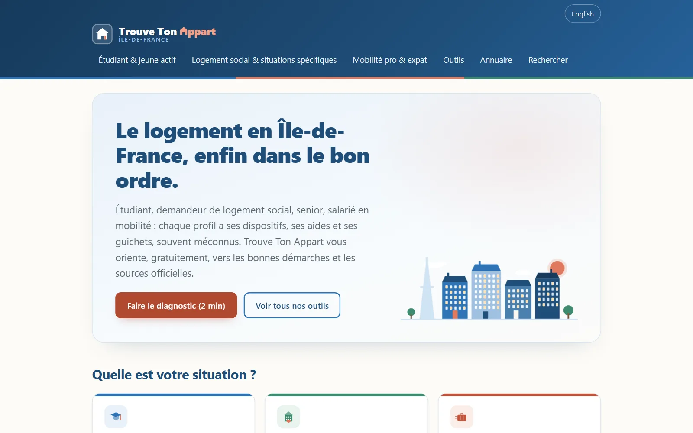

<p align="center">
  
</p>

<h1 align="center">Trouve Ton Appart : se loger en Île-de-France, par profil de vie</h1>

<p align="center">
  <strong>Le code source de <a href="https://trouve-ton-appart.fr">trouve-ton-appart.fr</a>, le guichet d'orientation gratuit du logement en Île-de-France : logement social, aides au logement, logement étudiant, mobilité professionnelle.</strong><br>
  20 guides vérifiés sur les sources officielles, trois outils sans inscription, un Observatoire des délais du logement social construit sur les données ouvertes. Pas d'annonces : le site oriente vers les guichets officiels. Chaque chiffre de ce dépôt est mesuré et daté.
</p>

<p align="center">
  <a href="https://trouve-ton-appart.fr">Site</a> ·
  <a href="https://trouve-ton-appart.fr/diagnostic/">Diagnostic logement</a> ·
  <a href="https://trouve-ton-appart.fr/outils/">Outils</a> ·
  <a href="https://trouve-ton-appart.fr/logement-social/delais/">Observatoire des délais</a> ·
  <a href="https://trouve-ton-appart.fr/guides/">Guides</a> ·
  <a href="https://trouve-ton-appart.fr/presse/">Presse</a> ·
  <a href="https://trouve-ton-appart.fr/en/">English site</a>
</p>

<p align="center">
  <a href="https://trouve-ton-appart.fr"></a>
  <a href="https://github.com/mkz-web/trouve-ton-appart/commits/main"></a>
  
  
  
  
</p>

<p align="center"><sub>Ce README est en français. <a href="#in-english">English summary at the end.</a></sub></p>

<p align="center">
  
  
</p>
<p align="center"><sub>Accueil en production, capturé le 09/09/2026 à 1 280 px et à 375 px par <code>site/capturer-readme.js</code>, consentement refusé avant le chargement (aucun bandeau, aucun script de mesure).</sub></p>

## Ce que ce dépôt contient

- ✅ **Un site statique de 76 pages** (sitemap du 09/09/2026). Trois parcours par profil de vie : [étudiant et jeune actif](https://trouve-ton-appart.fr/etudiant/), [logement social et situations spécifiques](https://trouve-ton-appart.fr/logement-social/), [mobilité pro et expat](https://trouve-ton-appart.fr/mobilite/). Puis 20 guides en français, 5 guides en anglais sous `/en/`, 24 pages d'annuaire, 9 pages de chiffres commune par commune, une [check-list de rentrée](https://trouve-ton-appart.fr/rentree/) et un [espace presse](https://trouve-ton-appart.fr/presse/).
- ✅ **20 guides vérifiés sur les sources primaires.** [Garantie Visale](https://trouve-ton-appart.fr/guides/visale/), [demande de logement social](https://trouve-ton-appart.fr/guides/demande-logement-social/), [recours DALO](https://trouve-ton-appart.fr/guides/recours-dalo/), [FSL](https://trouve-ton-appart.fr/guides/fonds-solidarite-logement/), [avance Loca-Pass](https://trouve-ton-appart.fr/guides/avance-loca-pass/), [aide Mobili-Jeune](https://trouve-ton-appart.fr/guides/aide-mobili-jeune/), [DossierFacile](https://trouve-ton-appart.fr/guides/dossierfacile/), [bail mobilité](https://trouve-ton-appart.fr/guides/bail-mobilite/), [SIAO et 115](https://trouve-ton-appart.fr/guides/siao-115-hebergement-urgence/), [Solibail](https://trouve-ton-appart.fr/guides/solibail/), [résidence sociale](https://trouve-ton-appart.fr/guides/residence-sociale/), [logement fonctionnaire](https://trouve-ton-appart.fr/guides/logement-fonctionnaire/), [bail réel solidaire](https://trouve-ton-appart.fr/guides/bail-reel-solidaire/), [aides au logement de la Ville de Paris](https://trouve-ton-appart.fr/guides/aides-logement-ville-de-paris/)... Chaque guide cite ses fiches officielles et porte sa vraie date de mise à jour.
- ✅ **L'[Observatoire des délais du logement social en Île-de-France](https://trouve-ton-appart.fr/logement-social/delais/).** Délai médian et pression de la demande pour 1 286 communes, d'après le socle DRIHL « demandes et attributions » (millésime 2025) : classement, carte choroplèthe en SVG, champ « Combien de temps dans votre commune ? ». Le chiffre régional cache tout : 31 mois de délai médian, 13,9 demandes en cours pour une attribution, et de 10 à 57 mois d'une commune à l'autre.
- ✅ **Trois outils qui tournent dans le navigateur, sans inscription ni envoi de données.** Le [diagnostic logement](https://trouve-ton-appart.fr/diagnostic/) : 7 questions, une feuille de route en 4 blocs, un moteur de règles de 21 cartes. Le [simulateur de plafonds de ressources](https://trouve-ton-appart.fr/guides/plafond-ressources-logement-social/) : verdict PLAI, PLUS, PLS ou LLI sur les 75 montants du barème 2026, jamais un montant d'aide. Le [vérificateur d'encadrement des loyers à Paris](https://trouve-ton-appart.fr/guides/encadrement-des-loyers-paris/) : la grille de l'arrêté préfectoral du 12 juin 2026, 2 560 références lues dans le PDF de l'arrêté lui-même.
- ✅ **Trois annuaires issus des données publiques.** 157 résidences CROUS, 141 foyers de jeunes travailleurs et 430 résidences autonomie, par département (CNOUS et FINESS, collectés le 11/06/2026), plus les chiffres du parc social de 464 communes : parc RPLS, loyer médian, vacance, taux SRU, zonage ABC.
- ✅ **Le socle SEO et GEO généré au build.** Sitemap aux dates réelles, JSON-LD (Article, FAQPage, Dataset, BreadcrumbList, ItemList, WebApplication) reparsé par script, `llms.txt` et `llms-full.txt` (370 Ko de contenu citable au 09/09/2026), `robots.txt` ouvert aux robots des IA avec directive Content-Signal, `hreflang` FR et EN, IndexNow.
- ✅ **La vie privée par construction.** Aucun script tiers avant consentement, bandeau maison à deux boutons identiques, les trois outils masqués à la mesure d'audience (`data-clarity-mask`), CSP, HSTS et `X-Frame-Options` sur chaque page.
- ✅ **Zéro dépendance.** 15 scripts Node natifs dans `site/`, 8 scripts d'ingestion et 2 bibliothèques maison dans `site/ingest/` : XLSX, CSV en Lambert-93, ZIP INSEE et PDF lus à la main. Rien à installer, jamais de `node_modules`.
- ✅ **Le journal des décisions.** [CLAUDE.md](CLAUDE.md) consigne les choix techniques et éditoriaux, les mesures et les pièges payés, avec leur date. C'est le premier fichier à lire avant de toucher au code. La stratégie et le suivi des partenariats vivent dans un journal privé, hors git.

<p align="center">
  
</p>
<p align="center"><sub>L'Observatoire des délais en production, capturé le 09/09/2026 à 1 280 px.</sub></p>

## Démarrer en trois commandes

```bash
git clone https://github.com/mkz-web/trouve-ton-appart.git && cd trouve-ton-appart
node site/build.js
node site/serve.js 8787
```

Le site est servi sur `http://localhost:8787/`. Avant toute publication, la barrière enchaîne build, liens internes, rendu mesuré dans un navigateur et contrôle SEO, et s'arrête à la première étape en échec :

```bash
node site/check-tout.js
```

Prérequis : Node 14 ou plus récent pour construire et servir ; Node 22 ou plus récent (WebSocket natif) et un Chrome ou Edge installé pour la barrière et les captures. Aucun compte, aucune clé : le build ne fait aucun appel réseau, il régénère les 76 pages depuis les instantanés committés dans `site/data/open/`. Les rafraîchir est une commande à part, `node site/ingest/ingest.js`, la seule qui sorte sur le réseau.

## Pourquoi c'est construit comme ça

Huit décisions structurent le dépôt. Chacune est argumentée, avec les chiffres qui l'ont tranchée, dans [CLAUDE.md](CLAUDE.md).

| Décision | Pourquoi | Où c'est écrit |
|---|---|---|
| Un guichet d'orientation, pas un portail d'annonces de plus | La demande la plus forte est informationnelle et personne n'y répond en un seul endroit. Le site explique, puis renvoie vers le guichet officiel. | CLAUDE.md « Positionnement », `llms.txt` |
| Générateur Node natif, zéro dépendance, build sans réseau | Régénérable des années plus tard sur une machine vierge, en 0,3 seconde, identique en local et chez l'hébergeur. Les données ouvertes sont ingérées à part et committées en instantanés. | `site/build.js`, `site/ingest/ingest.js` |
| Données ouvertes uniquement, jamais de scraping des portails | Chaque jeu porte sa licence et son attribution sur la page qui le publie. Le scraping des portails d'annonces est écarté par principe et par jurisprudence. | CLAUDE.md « Collecte de données », bloc `_meta` de `site/data/open/*.json` |
| Chaque fait vient d'une source primaire, relu par un relecteur adverse, corrigé sous 48 h | Un guide juste qui vieillit devient un guide faux. Source citée, date de mise à jour réelle, engagement de correction affiché sur le site. | sections « Sources officielles » des guides, [espace presse](https://trouve-ton-appart.fr/presse/) |
| Des verdicts d'éligibilité, jamais un montant d'aide | Les barèmes de plafonds sont publics et exacts, un calcul d'APL ne le serait pas. Le simulateur dit « PLUS » ou « au-dessus des plafonds », pas « 212 euros par mois ». | `site/data/plafonds.json` |
| Ce que vous saisissez ne quitte pas votre navigateur | Les trois outils calculent côté client sur des JSON statiques, et leurs zones sont masquées à la mesure d'audience, accord ou pas. | `CONSENT_JS` et `data-clarity-mask` dans `site/build.js` |
| Le build refuse plutôt que de servir un doute | Guide modifié sans re-datation, licence inconnue, grille de loyers hors de sa période, guide sans suite ni parcours : le build échoue et dit quoi faire. Un contrôle se déclenche sur l'inconnu, pas seulement sur le faux. | `controleMaillage`, `datasetLd`, `ENCADREMENT_VIGUEUR` dans `site/build.js` |
| Ouvert aux robots des IA, et déclaré comme tel | Les robots des moteurs de réponse passent tous les jours (193 passages en 24 h, un tiers du trafic, mesuré le 14/08/2026). Le `robots.txt` les autorise et l'écrit (Content-Signal). Aucun fichier n'est vendu comme levier d'acquisition : l'autorité du site décide d'une citation. | `robots.txt` et `llms.txt` générés par `site/build.js` |

## Ce qui est mesuré

Tous les relevés ci-dessous sont reproductibles avec les scripts du dépôt ou les outils cités. Ce qui n'a pas été mesuré n'y figure pas.

| Invariant | Relevé | Date | Méthode |
|---|---|---|---|
| Barrière avant publication | 4 étapes vertes en 14,6 s | 09/09/2026 | `node site/check-tout.js` |
| Liens internes et fichiers publiés | 4 458 liens vérifiés, 0 cassé ; 99 fichiers publiés, 0 orphelin | 09/09/2026 | `node site/check-links.js` |
| Pages et taille du site | 76 URL au sitemap, 99 fichiers, 6,8 Mio dans `dist/` | 09/09/2026 | build du jour, sitemap de production comparé au build |
| Rendu sur toutes les pages | 77 pages × 3 largeurs (375, 768, 1 280 px), 0 défaut | 29/08/2026 | `node site/check-tout.js --toutes` |
| Lighthouse mobile en production | Performance 100 / 100 et accessibilité 100 / 100 sur l'accueil, un guide et une page de 196 communes ; LCP 1,0 à 1,1 s, CLS 0 | 14/07/2026 | Lighthouse mobile sur les URL de production |
| Accès réel des robots des IA | 80 requêtes (20 user-agents × 4 URL), 80 réponses 200, tailles identiques à l'octet, aucun `X-Robots-Tag` | 15/08/2026 | curl avec les user-agents GPTBot, ClaudeBot, PerplexityBot, Googlebot, Bingbot... |
| En-têtes de sécurité et hôtes | HSTS, CSP, `X-Frame-Options: DENY`, `Permissions-Policy` sur l'apex ; `www` en 301 vers l'apex ; `trouve-ton-appart.pages.dev` en `X-Robots-Tag: noindex` | 09/09/2026 | `curl -I` sur les trois hôtes |
| Contrastes de texte | Minimum 4,75:1 en clair et 7,07:1 en sombre sur 7 gabarits (seuil AA : 4,5:1) | 08/08/2026 | styles calculés dans le navigateur, thème sombre émulé |
| Grille d'encadrement lue dans le PDF | Le même code appliqué à l'arrêté 2025 rend la grille publiée en données ouvertes pour ce millésime : 1 344 valeurs, 80 quartiers, 0 écart | 04/09/2026 | `node site/ingest/ingest-encadrement-arrete.js --recette` |

## Les données ouvertes ingérées

Chaque jeu est téléchargé par un script de `site/ingest/`, transformé en JSON et committé dans `site/data/open/` avec son bloc `_meta` (source, licence, collecte, millésime). Le site en sert une partie telle quelle : [`/data/delais-communes.json`](https://trouve-ton-appart.fr/data/delais-communes.json), [`/data/encadrement-loyers-paris.json`](https://trouve-ton-appart.fr/data/encadrement-loyers-paris.json), la [carte des délais en SVG](https://trouve-ton-appart.fr/carte-delais-logement-social-idf.svg) et [`llms-full.txt`](https://trouve-ton-appart.fr/llms-full.txt). Citez la source et la date en cas de réutilisation.

| Jeu | Source | Licence | Enregistrements | Collecte |
|---|---|---|---|---|
| Demandes et attributions de logements sociaux (délais, pression) | DRIHL Île-de-France, Infocentre SNE, socle XLSX | Licence Ouverte Etalab 2.0 | 1 286 communes | 18/07/2026, millésime 2025 |
| Parc locatif social par commune | RPLS Insee-SDES, inventaire SRU, zonage ABC | Licence Ouverte Etalab 2.0 | 464 communes | 11/06/2026, données au 01/01/2024 |
| Résidences universitaires | CNOUS, jeu `fr_crous_logement_france_entiere` | Licence Ouverte Etalab 2.0 | 157 résidences | 11/06/2026 |
| Foyers de jeunes travailleurs et résidences autonomie | FINESS, catégories 257 et 202, CSV en Lambert-93 | Licence Ouverte Etalab | 141 FJT, 430 résidences | 11/06/2026 |
| Loyers de référence à Paris | Arrêté préfectoral du 12 juin 2026, lu dans son PDF | Acte administratif | 2 560 références | 04/09/2026, en vigueur du 01/07 au 24/11/2026 |
| Contours des communes (fond de carte) | Admin Express IGN-Insee via l'API Géo | Licence Ouverte Etalab 2.0 | 1 266 contours simplifiés | 12/08/2026 |

Les lecteurs de PDF (`site/ingest/pdf.js`) et de XLSX (`site/ingest/lib.js`) sont écrits à la main sur `zlib` : un XLSX est un ZIP de XML, un PDF une suite de flux compressés. Rien à installer pour lire un arrêté ou un socle DRIHL.

## Structure du dépôt

```text
site/build.js            le générateur : 76 pages, sitemap, robots.txt, llms.txt, JSON-LD, CSS et JS inline
site/data/               contenu éditorial : guides.json, en.json, parcours.json, diagnostic.json, plafonds.json, dates-guides.json, place-ids.json (fiches Google Maps appariées)
site/data/open/          instantanés des données ouvertes (committés, build sans réseau) ; archives/ par millésime
site/ingest/             ingestion : CROUS, RPLS et SRU, FINESS, DRIHL, contours, arrêté PDF ; lib.js et pdf.js maison
site/static/             favicon.ico, apple-touch-icon.png, og-image.png, illustrations WebP
site/dist/               sortie du build, ignorée par git
.github/readme/          captures et logo de ce README, avec leur relevé (captures.json)
_encadrement/ _ux/       rapports de méthode : extraction de l'arrêté des loyers, contrôle UX mesuré
CLAUDE.md                journal des décisions techniques et éditoriales, des mesures et des pièges
CLAUDE-prive.md          journal privé, ignoré par git (stratégie, partenariats, audience, identifiants)
```

## Scripts

Tous en Node natif, sans rien installer. Chaque script porte en tête sa commande, son runtime minimal et « Dépendances : aucune ».

| Script | Rôle |
|---|---|
| `build.js` | Génère le site dans `dist/` depuis `data/` ; refuse de construire si un invariant est cassé |
| `check-tout.js` | La barrière avant publication : build, liens, rendu, SEO, arrêt à la première étape en échec |
| `check-links.js` | Tout lien interne pointe sur une page, tout fichier publié est cité quelque part |
| `check-rendu.js` | Mesure les pages rendues dans le navigateur installé, à 3 largeurs : débordements, chevauchements, cibles trop petites |
| `check-seo.js` | Titles, metas, JSON-LD reparsés, règles ItemList et BreadcrumbList |
| `date-guides.js` | Dates réelles de publication et de modification par guide, empreinte du contenu à l'appui |
| `serve.js` | Serveur statique de développement pour `dist/` |
| `indexnow.js` | Soumet le sitemap de production aux moteurs IndexNow après une publication vérifiée |
| `indexnow-cle.js` | La clé IndexNow, publique par conception, source unique du build et du ping |
| `generate-favicon.js` | Rastériseur, encodeur PNG et conteneur ICO maison : `favicon.ico`, `apple-touch-icon.png` |
| `generate-og.js` | L'image Open Graph 1 200 × 630, rendue par le navigateur installé |
| `capturer-readme.js` | Les captures de ce README en production, consentement refusé avant le chargement, H1 et largeur contrôlés avant d'écrire |
| `atelier-correction.js` | Applique un lot de corrections, déroule la chaîne de répercussion, passe la barrière, s'arrête avant publication |
| `resoudre-lot.js` | Transforme les constats d'un rapport de veille en remplacements exacts pour l'atelier |
| `deploy.js` | Upload direct, conservé comme plan B documentaire : le projet est déployé par git |

Les 9 scripts d'ingestion de `site/ingest/` sont décrits avec leurs jeux dans le tableau des données ouvertes ; `ingest.js` enchaîne les cinq dont l'URL est prédictible, l'arrêté préfectoral se lance à la main à chaque nouvel arrêté, et `ingest-place-ids.js` (la fiche Google Maps de chaque résidence, lue par la SERP en direct de DataForSEO et jugée sur la distance aux coordonnées officielles, l'adresse et le nom) se lance à la demande, parce qu'une passe complète coûte de l'ordre de deux dollars.

## Déploiement

Cloudflare Pages, projet `trouve-ton-appart` connecté à ce dépôt : chaque push sur `main` déclenche `node site/build.js` et publie `site/dist/` sur `https://trouve-ton-appart.fr`. Le sous-domaine `trouve-ton-appart.pages.dev` est servi en `X-Robots-Tag: noindex` (fichier `_headers` écrit par le build) et `www` redirige en 301 vers l'apex : ce ne sont pas des adresses publiques.

Un push réussi ne prouve pas la mise en ligne : après chaque publication, vérifier le contenu servi (sitemap et JSON identiques au build), puis lancer `node site/indexnow.js`. Le circuit Google reste la Search Console. Une seule variable d'environnement, par son nom : `CLOUDFLARE_API_TOKEN_TTA`, pour les diagnostics et le plan B `deploy.js` ; rien n'est nécessaire pour construire ni contrôler le site.

## Contribuer, signaler

Le dépôt montre comment le site est fait. Une coquille, un lien cassé, un chiffre qui a vieilli, un défaut d'affichage sur un appareil : ouvrez une [issue](https://github.com/mkz-web/trouve-ton-appart/issues) ou écrivez à [mickael@trouve-ton-appart.fr](mailto:mickael@trouve-ton-appart.fr). Une pull request de correction est la bienvenue si elle respecte trois règles :

1. **Un fait vient d'une source primaire**, citée et datée : fiche service-public, Légifrance, arrêté, socle de données. Une source secondaire, même gouvernementale, ne suffit pas.
2. **Corriger un guide, c'est corriger toute sa chaîne** : `guides.json`, l'encadré « L'essentiel », `diagnostic.json`, `en.json` pour une jumelle anglaise, la check-list de rentrée, puis `node site/date-guides.js`.
3. **`node site/check-tout.js` passe** avant toute demande de fusion.

Ne pas éditer `site/dist/` (régénéré) ni les instantanés de `site/data/open/` (une retouche manuelle disparaît à l'ingestion suivante).

## À propos

Site édité par **MKZ**, société par actions simplifiée, SIRET 983 662 784 00013, 1 rue Françoise Sagan, 77230 Dammartin-en-Goële. Directeur de la publication : Mickaël Leclerc, ingénieur IT et consultant SEO et référencement IA ([MKZ Consulting](https://mkz-consulting.fr)).

Contact : [mickael@trouve-ton-appart.fr](mailto:mickael@trouve-ton-appart.fr). Réponse le jour même en semaine, correction de toute inexactitude signalée sous 48 h.

## Licence

Pas de licence open source sur le code, les textes, la marque et les visuels : tous droits réservés, MKZ. Le dépôt est lisible pour la transparence et l'inspiration ; il n'est pas réutilisable tel quel.

Les instantanés de `site/data/open/` gardent la licence de leur producteur, écrite dans leur bloc `_meta` : Licence Ouverte Etalab pour DRIHL, RPLS, CNOUS, FINESS et IGN (réutilisation libre avec mention de la source), acte administratif pour l'arrêté préfectoral. Ces licences valent pour les données, pas pour le code qui les lit.

## In English

This is the source code of [trouve-ton-appart.fr](https://trouve-ton-appart.fr/en/), a free, independent guidance site for finding housing in Paris and the Île-de-France region: social housing, housing benefits, student housing and relocation. It publishes no listings; it explains each scheme and sends readers to the official counters. A 76-page static site generated by a dependency-free Node script and hosted on Cloudflare Pages: 20 French guides checked against primary sources and dated, 5 English guides for newcomers ([Visale guarantee](https://trouve-ton-appart.fr/en/guides/visale-guarantee/), [guarantor in France](https://trouve-ton-appart.fr/en/guides/guarantor-in-france/), [DossierFacile](https://trouve-ton-appart.fr/en/guides/dossierfacile/), [mobility lease](https://trouve-ton-appart.fr/en/guides/mobility-lease/), [rent control in Paris](https://trouve-ton-appart.fr/en/guides/paris-rent-control/)), three browser-side tools that never send your answers anywhere, and the Observatory of social housing waiting times for 1,286 municipalities (DRIHL open data, 2025 edition), with a map and a per-town lookup.

All data comes from French open data (Etalab Open Licence) or from the prefectoral order read from its own PDF; nothing is scraped from listing portals. Every figure here was measured on a stated date. Quick start: `node site/build.js`, `node site/serve.js 8787`, and `node site/check-tout.js` before publishing (Node 22, an installed Chrome or Edge). Decisions and measurements are logged in [CLAUDE.md](CLAUDE.md), in French. No open source licence: all rights reserved; the data snapshots keep their producers' licences.
